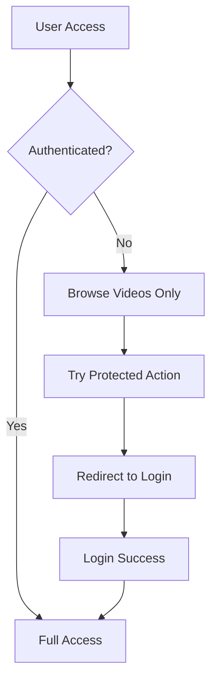

# Dailymotion WebApp Clone

A modern video-sharing platform inspired by Dailymotion, built with React.js, Vite, and Tailwind CSS. This application provides a seamless video browsing experience with user authentication, watchlist management, and comprehensive search functionality.

## 🚀 Features

### Core Functionality

- **Video Browsing Without Login**: Browse and watch videos without requiring authentication
- **User Authentication**: Secure login and signup with data stored in localStorage
- **Watchlist Management**: Save favorite videos for later viewing (requires authentication)
- **Video Playback**: Smooth video streaming with custom player controls
- **Responsive Design**: Mobile-first approach with Tailwind CSS

### Technical Features

- **State Management**: Redux Toolkit for efficient data management
- **Authentication Flow**: Automatic redirect to login when accessing protected features
- **Local Storage**: Persistent user data storage
- **Modern UI/UX**: Clean, intuitive interface with Tailwind CSS
- **Fast Development**: Vite for lightning-fast build and development

## 🛠️ Tech Stack

- **Frontend Framework**: React.js 18+
- **Build Tool**: Vite
- **Styling**: Tailwind CSS
- **State Management**: Redux Toolkit
- **Routing**: React Router DOM
- **Authentication**: Custom implementation with localStorage
- **UI Components**: Custom components with Tailwind

## 📋 Prerequisites

Before running this application, make sure you have the following installed:

- Node.js (v16.0.0 or higher)
- npm or yarn package manager
- Git

## 🚀 Installation & Setup

### 1. Clone the Repository

```bash
git clone https://github.com/Tiwari-Suraj/NEWS_App.git
cd dailymotion-webapp
```

### 2. Install Dependencies

```bash
npm install
# or
yarn install
```

### 3. Environment Setup

Create a `.env` file in the root directory:

```env
VITE_APP_NAME=Dailymotion WebApp
VITE_API_BASE_URL=http://localhost:3000
```

### 4. Start Development Server

```bash
npm run dev
# or
yarn dev
```

The application will be available at `http://localhost:5173`

## 📁 Project Structure

```
dailymotion-webapp/
├── public/
│   ├── index.html
│   └── favicon.ico
├── src/
│   ├── components/
        ├── Naws/
            ├── HW News English.jsx
            ├── HW News.jsx.jsx
│   │   ├── Navbar.jsx
│   │   ├── Sidebar.jsx
│   │   ├── VideoCard.jsx
│   │   ├── AuthForm.jsx
        ├── ProtectedRoute.jsx
│   │   └── ProtectedRoute.jsx
│   ├── pages/
│   │   ├── Home.jsx
│   │   ├── VideoPage.jsx
│   │   ├── Login.jsx
│   │   ├── Explore.jsx
│   │   ├── ForYou.jsx
│   │   └── Footer.jsx
│   ├── redux/
│   │   ├── store.js
│   │   ├── slices/
│   │   │   ├── authSlice.js
│   │   │   ├── videoSlice.js
│   │   │   └── watchlistSlice.js
│   ├── utils/
│   │   ├── localStorage.js
│   │   └── constants.js
│   ├── data/
│   │   └── videoData.js
│   ├── App.jsx
│   ├── main.jsx
│   └── index.css
├── package.json
├── vite.config.js
├── tailwind.config.js
└── README.md
```

## 🔧 Configuration

### Tailwind CSS Setup

The project uses Tailwind CSS for styling. Configuration is in `tailwind.config.js`:

```javascript
module.exports = {
  content: ["./index.html", "./src/**/*.{js,ts,jsx,tsx}"],
  theme: {
    extend: {
      colors: {
        primary: "#FF6B35",
        secondary: "#004E89",
      },
    },
  },
  plugins: [],
};
```

### Redux Store Configuration

State management is handled by Redux Toolkit with the following slices:

- **authSlice**: User authentication state
- **videoSlice**: Video data and playback state
- **watchlistSlice**: User's saved videos

## 🎯 Usage Guide

### Browsing Videos (No Authentication Required)

1. Open the application
2. Browse through video listings on the homepage
3. Click on any video to watch
4. Use the search bar to find specific content

### User Authentication

1. Click "Login" or "Sign Up" in the navigation
2. Fill in the required credentials
3. User data is stored in localStorage for persistence
4. Access protected features like watchlist management

### Watchlist Management

1. **Adding Videos**: Click the "Add to Watchlist" button (requires login)
2. **Viewing Watchlist**: Navigate to the watchlist page
3. **Removing Videos**: Click remove button on watchlist items

### Search Functionality

1. Use the search bar in the navigation
2. Enter keywords to find relevant videos
3. Results update in real-time

## 📱 Responsive Design

The application is fully responsive with breakpoints:

- **Mobile**: < 768px
- **Tablet**: 768px - 1024px
- **Desktop**: > 1024px

## 🔐 Authentication Flow



## 🗄️ Data Storage

### Redux State Structure

```javascript
{
  auth: {
    isAuthenticated: boolean,
    user: object | null,
    loading: boolean
  },
  videos: {
    allVideos: array,
    selectedVideo: object | null,
    searchResults: array,
    loading: boolean
  },
  watchlist: {
    items: array,
    loading: boolean
  }
}
```

### localStorage Schema

```javascript
{
  "user": {
    "id": "unique_id",
    "email": "user@example.com",
    "name": "User Name",
    "createdAt": "timestamp"
  },
  "watchlist": ["video_id_1", "video_id_2"],
  "preferences": {
    "theme": "light",
    "language": "en"
  }
}
```

## 🧪 Testing

### Running Tests

```bash
npm run test
# or
yarn test
```

### Testing Checklist

- [ ] Video playback functionality
- [ ] User authentication flow
- [ ] Watchlist operations
- [ ] Search functionality
- [ ] Responsive design
- [ ] Navigation between pages
- [ ] localStorage persistence
- [ ] Error handling

## 🚀 Deployment

### Build for Production

```bash
npm run build
# or
yarn build
```

### Deploy to Netlify

1. Build the project: `npm run build`
2. Deploy the `dist` folder to Netlify
3. Configure redirects for React Router

### Deploy to Vercel

1. Connect your GitHub repository
2. Vercel automatically detects Vite configuration
3. Deploy with default settings

## 🐛 Common Issues & Solutions

### Issue: Videos not loading

**Solution**: Check video data in Redux store and ensure proper video URLs

### Issue: Authentication not persisting

**Solution**: Verify localStorage implementation and check browser settings

### Issue: Build errors

**Solution**: Clear node_modules and reinstall dependencies

## 🤝 Contributing

1. Fork the repository
2. Create a feature branch: `git checkout -b feature-name`
3. Commit changes: `git commit -m 'Add feature'`
4. Push to branch: `git push origin feature-name`
5. Submit a pull request

## 📄 License

This project is licensed under the MIT License - see the [LICENSE](LICENSE) file for details.

## 👥 Authors

- **Your Name** - Initial work - [YourGitHub](https://github.com/your-username)

## 🙏 Acknowledgments

- Inspired by Dailymotion's user interface
- Built with modern React.js ecosystem
- Tailwind CSS for rapid UI development
- Redux Toolkit for state management

## 📞 Support

For support and questions:

- Email: support@yourapp.com
- GitHub Issues: [Create an issue](https://github.com/your-username/dailymotion-webapp/issues)

---

**Happy Coding! 🎉**
